  

  <a href="https://leejc02.github.io/"><b>Portfolio &nearr;</b></a>
  &nbsp;&nbsp;&nbsp;
  <a href="https://github.com/LeeJc02"><b>GitHub &nearr;</b></a>

## Selected Work

## A Way of Building

  

  
<b>Open the playground</b>

   
  <picture>
    <source media="(prefers-color-scheme: dark)" srcset="https://raw.githubusercontent.com/LeeJc02/LeeJc02/output/github-contribution-grid-snake-dark.svg" />
    <source media="(prefers-color-scheme: light)" srcset="https://raw.githubusercontent.com/LeeJc02/LeeJc02/output/github-contribution-grid-snake.svg" />
    
  </picture>

---

  Designed in code. Built with curiosity. 
  <a href="https://leejc02.github.io/">Portfolio</a>
  &nbsp;&middot;&nbsp;
  <a href="https://github.com/LeeJc02?tab=repositories">All repositories</a>

