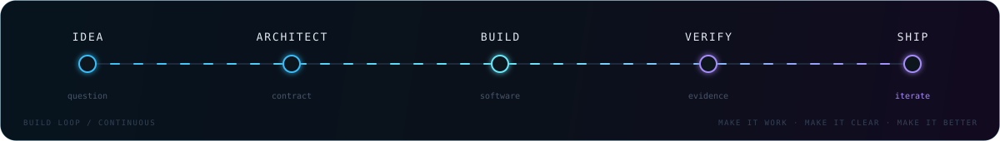

<div align="center">
  
</div>

<p align="center">
  <a href="https://github.com/LeeJc02?tab=followers"></a>
  <a href="https://github.com/LeeJc02?tab=repositories"></a>
  
</p>

<p align="center">
  <a href="https://leejc02.github.io"><b>ENTER INTERACTIVE PORTFOLIO ↗</b></a>
  &nbsp;&nbsp;·&nbsp;&nbsp;
  <a href="https://github.com/LeeJc02?tab=repositories"><b>EXPLORE SYSTEMS ↗</b></a>
</p>

<p align="center">
  <a href="https://git.io/typing-svg"></a>
</p>

## `01 / signal`

```yaml
identity: LeeJc02
role: Computer Science Student & Open-source Builder
focus: [Distributed Systems, AI Agents, Full-stack Products]
current_mode: Building software that survives beyond the demo
operating_principle: "Ship with proof. Learn in public. Iterate deliberately."
```

我喜欢把一个想法一路做到 **能运行、能交付、能被验证**。当前探索横跨实时通信、分布式服务、AI Agent 与现代 Web；比起堆叠技术名词，我更关心一个系统如何从 prototype 走到 production。

<div align="center">
  
</div>

## `02 / selected_systems`

<table>
  <tr>
    <td width="50%" valign="top">
      <sub>01 · AI / SAFETY</sub>
      <h3>MedOrbit</h3>
      <p><b>Evidence-first medication safety agent.</b></p>
      <p>面向药物安全工作流的临床分诊系统：Go 网关、Python gRPC runtime、可审计回放与证据质量评估。</p>
      <p>
        
        
        
      </p>
      <a href="https://github.com/LeeJc02/MedOrbit"><b>OPEN SYSTEM ↗</b></a>
    </td>
    <td width="50%" valign="top">
      <sub>02 · DISTRIBUTED / REALTIME</sub>
      <h3>WeHi</h3>
      <p><b>Desktop-grade distributed messaging.</b></p>
      <p>具有桌面端体验的全栈 IM：独立认证、业务 API 与实时服务，支持增量同步、多端会话和容器化交付。</p>
      <p>
        
        
        
      </p>
      <a href="https://github.com/LeeJc02/WeHi"><b>OPEN SYSTEM ↗</b></a>
    </td>
  </tr>
  <tr>
    <td width="50%" valign="top">
      <sub>03 · OPEN SOURCE / RISC-V</sub>
      <h3>PLCT Works</h3>
      <p><b>Engineering field notes from the open-source frontier.</b></p>
      <p>PLCT 实验室 RevyOS 小队实习记录：RISC-V 设备测试、问题复现、性能 Benchmark 与开源文档贡献。</p>
      <p>
        
        
        
      </p>
      <a href="https://github.com/LeeJc02/PLCT-Works"><b>READ FIELD NOTES ↗</b></a>
    </td>
    <td width="50%" valign="top">
      <sub>04 · COMPUTER SCIENCE / COURSEWORK</sub>
      <h3>YSU Project</h3>
      <p><b>Learning in public, one system at a time.</b></p>
      <p>燕山大学计算机科学与技术课程项目档案，记录从 C/C++、Qt 到数据结构与人工智能的学习轨迹。</p>
      <p>
        
        
        
      </p>
      <a href="https://github.com/LeeJc02/YSU_Project"><b>EXPLORE ARCHIVE ↗</b></a>
    </td>
  </tr>
</table>

## `03 / toolchain`

<p align="center">
  
</p>

## `04 / telemetry`

<p align="center">
  
</p>

<p align="center">
  
</p>

<details>
  <summary><b>OPEN CONTRIBUTION STREAM</b></summary>
  <br />
  <picture>
    <source media="(prefers-color-scheme: dark)" srcset="https://raw.githubusercontent.com/LeeJc02/LeeJc02/output/github-contribution-grid-snake-dark.svg" />
    <source media="(prefers-color-scheme: light)" srcset="https://raw.githubusercontent.com/LeeJc02/LeeJc02/output/github-contribution-grid-snake.svg" />
    
  </picture>
</details>

---

<p align="center">
  <code>STAY CURIOUS · SHIP THINGS · LEAVE THE CODEBASE BETTER</code>
</p>
